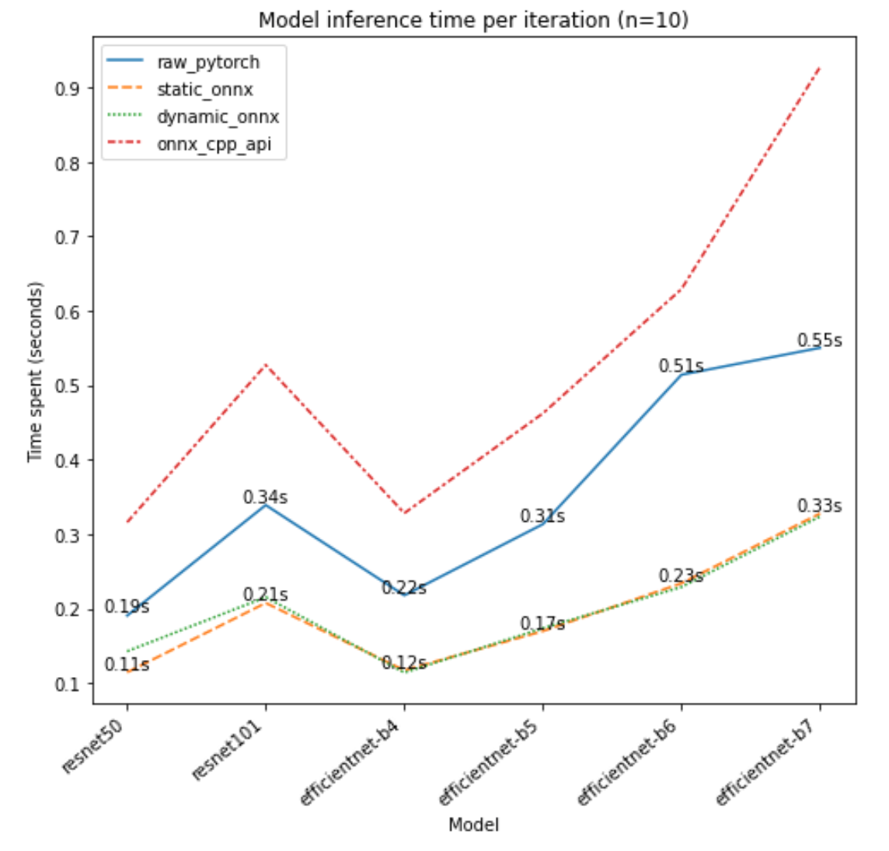

Experimenting on

https://colab.research.google.com/drive/1JXzXEpR6_w5W1doFgUoY5lDl1L7tIAXx

# Table of Contents
* [Deep Learning Deployment](#dld)
    1. [Environmental info](#ei)
    2. [Target](#ta)
    3. [Experiment](#ex)
    4. [TODO](#todo)
    5. [NOTE](#note)
    
    
# <a name="dld">1. Deep Learning Deployment

## <a name="ei">Environmental info
* Cpu experiment environment
    
        - Ubuntu 18.04.5 LTS
        - Cpu 2 cores Intel(R) Xeon(R) CPU @ 2.30GHz
        - RAM 8GB DIMM RAM Synchronous
        
        - Python 3.6.9
        - torch 1.9.0+cu102
        - torchvision 0.10.0+cu102
        - OpenCV 4.5.2
        - Onnxruntime v1.8.2
        - TVM 0.8
        - OpenVINO 2021.1.110
        
* Gpu experiment environment 
    
        - Ubuntu 18.04.5 LTS
        - Cpu 2 cores Intel(R) Xeon(R) CPU @ 2.30GHz
        - RAM 12GB
        - GPU Tesla K80    
    
        - Python 3.7.11    
        - CUDA 11.2
        - Cudnn 7.6.5                
        - torch 1.9.0+cu102
        - torchvision 0.10.0+cu102
        - OpenCV 4.5.2 built with CUDA
        - TensorRT 8.0.1.6
    
## <a name="ta">Target
* Have an overall understanding of multiple frameworks used for speeding up deployment and get familiar with their structure. eg. Onnxruntime, TensorRT, TVM, Openvino, etc.
* Compare the inference speed of frameworks above.
* Further speed up: deploy models using C++.
  
## <a name="ex">Experiment
1. cpu: onnx vs pytorch
    * There's no difference among outputs of raw pytorch models, static/dynamic onnx models and cpp api models. (e-10)
    * The inference speed of static onnx models is the fastest, at most approximately 2x compared to the one of raw pytorch models.

    

    
    
## <a name="todo">TODO
* Openvino (python / cpp api)   
* Tvm cpp api   
* EfficienNet on TVM
* The neck and head of Mask-RCNN on TensorRT
* Mixed Precision quantization model
    
## <a name="note">NOTE
* cv::cuda::resize has different results compared to cv::resize (the former always use the INTER_NEAREST flat no matter what you pass)
    https://github.com/opencv/opencv/issues/4728
