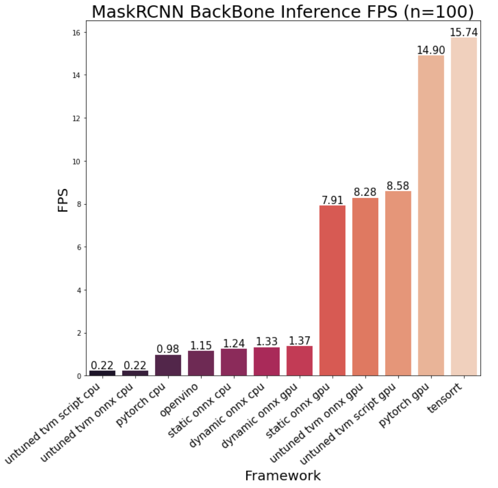

Experimenting GPU/Mask-RCNN environment on:

https://colab.research.google.com/drive/1JXzXEpR6_w5W1doFgUoY5lDl1L7tIAXx

Experimenting CPU environment on Google Cloud Platform (notebook and results uploaded to colab)

https://colab.research.google.com/drive/1Y9-2_lAH9YzHl8H6vNbTV7rk8iKXb4oQ

# Table of Contents
* [Deep Learning Deployment](#dld)
    1. [Environmental info](#ei)
    2. [Target](#ta)
    3. [Experiment](#ex)
    4. [TODO](#todo)
    5. [NOTE](#note)
    6. [Summary](#su)
    
    
# <a name="dld">1. Deep Learning Deployment

## <a name="ei">Environmental info
* Cpu experiment environment
    
        - Ubuntu 18.04.5 LTS
        - Cpu 4 cores Intel(R) Xeon(R) CPU @ 2.30GHz
        - RAM 16 GB DIMM RAM Synchronous
        
        - Python 3.6.9
        - torch 1.9.0+cu102
        - torchvision 0.10.0+cu102
        - OpenCV 4.5.2
        - Onnxruntime v1.8.2
        - TVM 0.8
        - OpenVINO 2021.1.110
        
* Gpu experiment environment 
    
        - Ubuntu 18.04.5 LTS
        - Cpu 2 cores Intel(R) Xeon(R) CPU @ 2.30GHz
        - RAM 12GB
        - GPU Tesla K80    
    
        - Python 3.7.11    
        - CUDA 11.2
        - Cudnn 7.6.5                
        - torch 1.9.0+cu102
        - torchvision 0.10.0+cu102
        - OpenCV 4.5.2 built with CUDA
        - TensorRT 8.0.1.6
        - TVM 0.8
    
## <a name="ta">Target
* Have an overall understanding of multiple frameworks used for speeding up deployment and get familiar with their structure, eg. ONNX Runtime, TensorRT, TVM and Openvino.
* Compare the inference speed of frameworks above.
* Try to deploy models using C++ API.
* Try to use ctypes to call c++ implemented inference function.
* Modify preprocessing step to make sure different frameworks may have the same prediction.
* Try to find the framework speeding up Mask-RCNN the most. 
    
## <a name="ex">Experiment
#### 1. CPU (using ResNet50/101, EfficientNet-b4/5/6/7): Pytorch vs ONNX Runtime vs TVM vs OpenVINO
* Outputs from different frameworks are mostly the same. (mse=e-10)
* OpenVINO is 1.7x ~ 2.2x faster than Pyotrch. It's the best approach so far.
* ONNX Runtime is approximately 1.3x ~ 2x faster than Pytorch.
* Untuned TVM is slower than Pytorch.
    * Auto-scheduling-tuned TVM is slower than untuned one, still need to find better hyperparameter eg. target/num_trials/layout.
* ONNX Runtime C++ API is not only slower than python API but also Pytorch, probably not the best implementation or too much overhead.
* ONNX Runtime using ctypes to call c++ implemented function is much more slower, probably due to too much calling overhead. 
* Easy to use: ONNX Runtime > OpenVINO >>> TVM

    

     
    
#### 2. GPU (using ResNet50/101, EfficientNet-b4/5/6/7): Pytorch vs ONNX Runtime vs TensorRT vs TVM
* Outputs of Pytorch, ONNX Runtime and TVM are mostly the same. (mse=e-10)
    * Output of TensorRT vs Pytorch are slightly different. (mse=e-4)
* TensorRT Python API is 1.15x ~ 1.4x faster than Pytorch, the best so far.
* TensorRT C++ API is 1.12x ~ 1.4x faster than Pytorch, but slightly slower than Python API, probably not the best implementation or too much overhead.
* TensorRT FP16 is the slowest on ResNet (why?) but faster than Pytorch on EfficientNet. However, it's still slower than the normal TensorRT, probably due to the un-supported platform.
* Untuned TVM is at most 1.2x faster than pytorch, so we can expect performance of tuned TVM.
* ONNX Runtime is slower than pytorch, overhead?
* I have not tuned TVM on colab GPU environment yet due to too much time cost.
    
#### 3. Mask-RCNN on CPU/GPU:
* Because Mask-RCNN conversion failed on TensorRT / OpenVINO, so just comparing the whole model on ONNX Runtime / Pytorch / TVM.
    * FPS on GPU: Pytorch(2.69) > ONNX Runtime(1.5) > untuned TVM(1.08) > ONNX Runtime (dynamic shape)(0.76)
    * FPS on CPU: ONNX Runtime(0.18) > Pytorch (0.16) >>> untuned TVM (0.02)
    * Pytorch using old version(1.7.0) is slower than new version(1.9.0+cu102), FPS: 0.125 < 0.136                                                                 
                                                                                                  
* Use Backbone of Mask-RCNN to evaluate all frameworks.
    * FPS on GPU: TensorRT (15.74) > Pytorch(14.9) > untuned TVM (8.5) > ONNX Runtime (7.9) >>> ONNX Runtime (dynamic shape)(1.37)
    * FPS on CPU: ONNX Runtime (dynamic shape)(1.33) > ONNX Runtime (1.24) > OpenVINO(1.15) > Pytorch (0.98) >>> untuned TVM (0.22)
    * Tvm using onnx and TensorRT get different output from others???
    

    
    

      
    
## <a name="todo">TODO
* Test CPU TVM with bigger tuning option parameter num_measure_trials. (= 800*len(tasks)) (now just testing with 1/10 * ideal trials)
* Test GPU TVM with auto scheduling tuned.
* Try Tvm CPP API.
* Test best configuration on different framework.
* Try to successfuly convert Mask-RCNN using TensorRT / OpenVINO.
* Try mixed Precision model.
* Check why C++ API is not faster.
* Check why TensorRT FP16 is the slowest on ResNet.
* Check why ONNX Runtime is so slow on GPU (especially models using dynamic shape).
* Check outputs of Mask-RCNN backbone converted using onnx + tvm and tensorRT.
    
## <a name="note">NOTE
* cv::cuda::resize has different results compared to cv::resize (the former always use the INTER_NEAREST flat no matter what you pass)
    https://github.com/opencv/opencv/issues/4728
* Different models may need different package version to support, eg.
    * Mask-RCNN: pytorch to tvm: torch 1.7.0 + torchvision 0.8.1
    * Efficientnet: pytorch to onnx: torch 1.9.0, opset_level=10 (11 failed
    * Pytorch using old version(1.7.0) is slower than new version(1.9.0+cu102), FPS: 0.125 < 0.136
* Sometimes export Pytorch models to Onnx may fail (Unable to cast from non-held to held instance (T& to Holder<T>)) => restart runtime resolve the problem.
* Check lscpu before running test, like in colab, capability of cpu in cpu runtime is slightly lower than the one in gpu runtime, so some results between 2 runtime type might be confusing. (2.20GHz vs 2.30GHz)

## <a name="su">Summary
* Choices of frameworks:
    1. Depend on device. (GPU/CPU, support fp16?, intel CPU/GPU using OpenVINO and nvidia GPU using tensorRT)
    2. Depend on Time Budget. (TVM has great potential but takes a lot of time.).
    3. Easy to use: ONNX Runtime > OpenVINO ~ TensorRT >>> TVM
        * ONNX Runtime on GPU is slow.
    4. Packages in older version might be slower.
